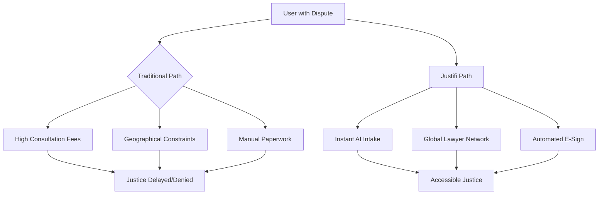
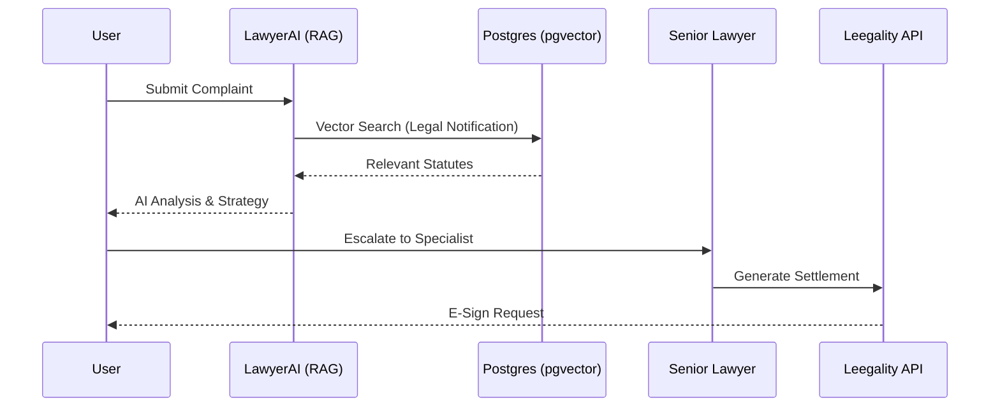
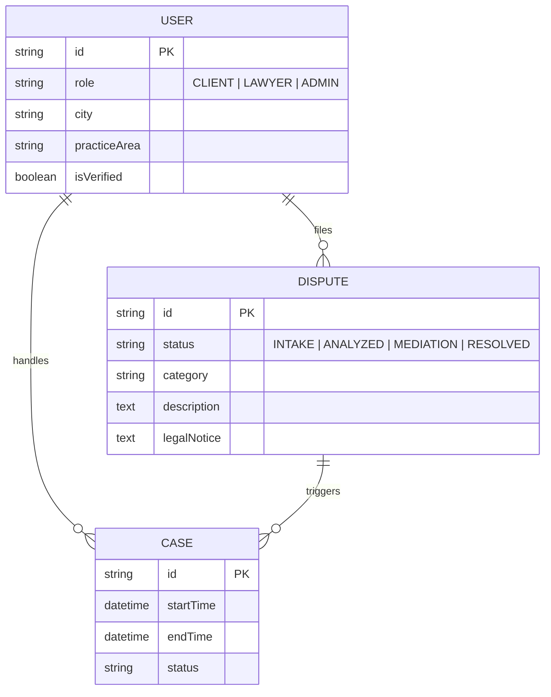
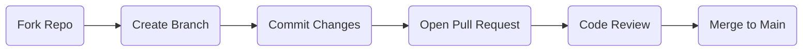

# Justifi  

<div align="center">
  
  
  <h3>AI-Powered Legal Advocacy & Dispute Resolution Pipeline</h3>
  
  <p align="center">
    Justifi democratizes access to justice by combining state-of-the-art AI with a verified network of legal professionals. From instant AI consultations to legally binding e-signed settlement agreements, we streamline the entire legal journey.
  </p>

  <p align="center">
    
    
    
    
    
  </p>
</div>

---

## 🚀 Live Demo

<div align="center">
  <p><i>[Animated GIF showing the AI Intake → Legal Notice → Lawyer Search flow]</i></p>
  
  <table>
    <tr>
      <td></td>
      <td></td>
    </tr>
    <tr>
      <td align="center"><b>AI Legal Assistant</b></td>
      <td align="center"><b>Verified Lawyer Discovery</b></td>
    </tr>
  </table>
</div>

---

## ⚖️ Problem Statement

The current legal system is opaque, expensive, and slow. Access to quality legal advice is often gated by high hourly rates and geographical barriers.



---

## 🛠️ Solution Overview

Justifi provides a modular, end-to-end legal pipeline:

1.  **AI Virtual Intake**: Uses RAG (Retrieval-Augmented Generation) against a massive legal notification database to provide grounded advice.
2.  **Automated Notice Generation**: Leverages AI to draft formal legal notices based on user complaints.
3.  **Specialist Matching**: Connects users with lawyers filtered by specialization and city-based proximity.
4.  **Dispute Dashboard**: A central hub for tracking mediation, penalties for non-responsive parties, and settlement drafts.
5.  **Legal Validity**: Integration with Leegality for official e-stamping and digital signatures.

---

## 🏗️ System Architecture

### High-Level Data Flow



### Database Schema (ERD)



---

## ✨ Core Features

| Feature | Description | Flow |
| :--- | :--- | :--- |
| **LawyerAI** | RAG-powered legal assistant providing grounded guidance. | `Input Query -> Embed -> Vector Search -> Synthesis` |
| **Lawyer Discovery** | City-based and specialty-based search for legal pros. | `Filter by City -> Real-time Matching -> Profile View` |
| **Dispute Pipeline** | Full lifecycle management from intake to settlement. | `Complaint -> Notice -> Mediation -> Resolution` |
| **E-Sign & Stamp** | Legally binding digital signatures via Leegality. | `Draft PDF -> Merge Stamp -> OTP Sign -> Notify` |

---

## 🧰 Tech Stack

<details>
<summary><b>Frontend Architecture</b></summary>
- **Framework**: Next.js 14 (App Router)
- **Styling**: Tailwind CSS & Vanilla CSS
- **Animations**: Framer Motion
- **Icons**: Lucide React
- **UI Components**: Radix UI (Shadcn)
</details>

<details>
<summary><b>Backend & AI</b></summary>
- **Server**: Next.js Server Actions
- **ORM**: Prisma
- **Auth**: Clerk
- **AI Engine**: OpenAI GPT-4 / LangChain (for RAG)
- **Vector DB**: pgvector on PostgreSQL
</details>

<details>
<summary><b>Integrations</b></summary>
- **Legal Compliance**: Leegality v3.0 (E-Sign, E-Stamp)
- **Email**: Nodemailer / SendGrid
- **Maps/Location**: Geolocation API
</details>

---

## 📂 Folder Structure

```text
├── actions/             # Server Actions (Business Logic)
├── app/                 # Next.js App Router (UI & Routing)
│   ├── (main)/          # Core Application Routes
│   ├── admin/           # Administrative Dashboard
│   ├── lawyers/         # Lawyer Discovery & Profiles
│   └── dispute/         # Dispute Resolution Dashboard
├── components/          # Reusable UI Components
├── hooks/               # Custom React Hooks
├── lib/                 # Shared utilities & schemas
├── prisma/              # Database schema & migrations
└── public/              # Static assets & logos
```

---

## 🔧 Installation & Setup

1.  **Clone the Repository**
    ```bash
    git clone https://github.com/YourUsername/Justifi.git
    cd Justifi
    ```

2.  **Install Dependencies**
    ```bash
    npm install
    ```

3.  **Environment Configuration**
    Create a `.env` file from the sample:
    ```env
    DATABASE_URL="postgresql://..."
    NEXT_PUBLIC_CLERK_PUBLISHABLE_KEY="..."
    CLERK_SECRET_KEY="..."
    LEEGALITY_API_KEY="..."
    OPENAI_API_KEY="..."
    ```

4.  **Database Migration**
    ```bash
    npx prisma db push
    ```

5.  **Run Development Server**
    ```bash
    npm run dev
    ```

---

## 🗺️ Roadmap

```mermaid
gantt
    title Justifi Development Roadmap
    dateFormat  YYYY-MM-DD
    section UI/UX
    Premium Landing Page      :done,    des1, 2026-03-01, 2026-03-10
    Responsive Dashboards     :active,  des2, 2026-03-11, 2026-03-20
    section Features
    AI RAG Integration        :done,    feat1, 2026-03-05, 12d
    E-Sign Leegality v3.0    :done,    feat2, 2026-03-15, 5d
    Mobile App (React Native) :todo,    feat3, 2026-04-01, 30d
    section Optimization
    pgvector Performance      :active,  opt1, 2026-03-18, 7d
```

---

## 🤝 Contributing

We welcome contributions! Please follow the standard workflow:



---

## 📜 License & Credits

Distributed under the MIT License. See `LICENSE` for more information.

**Built with ❤️ by the Justifi Team.**